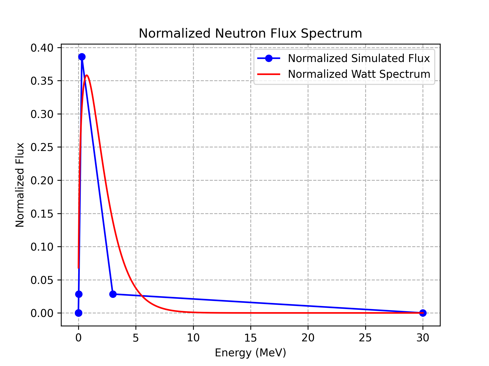
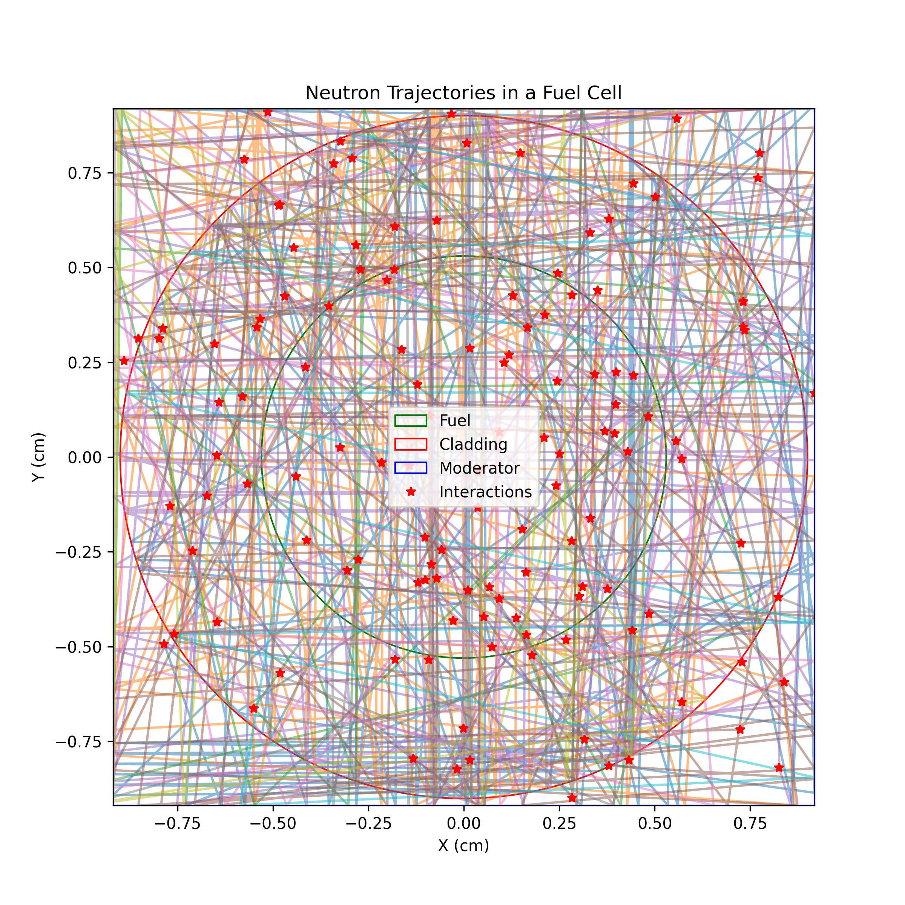
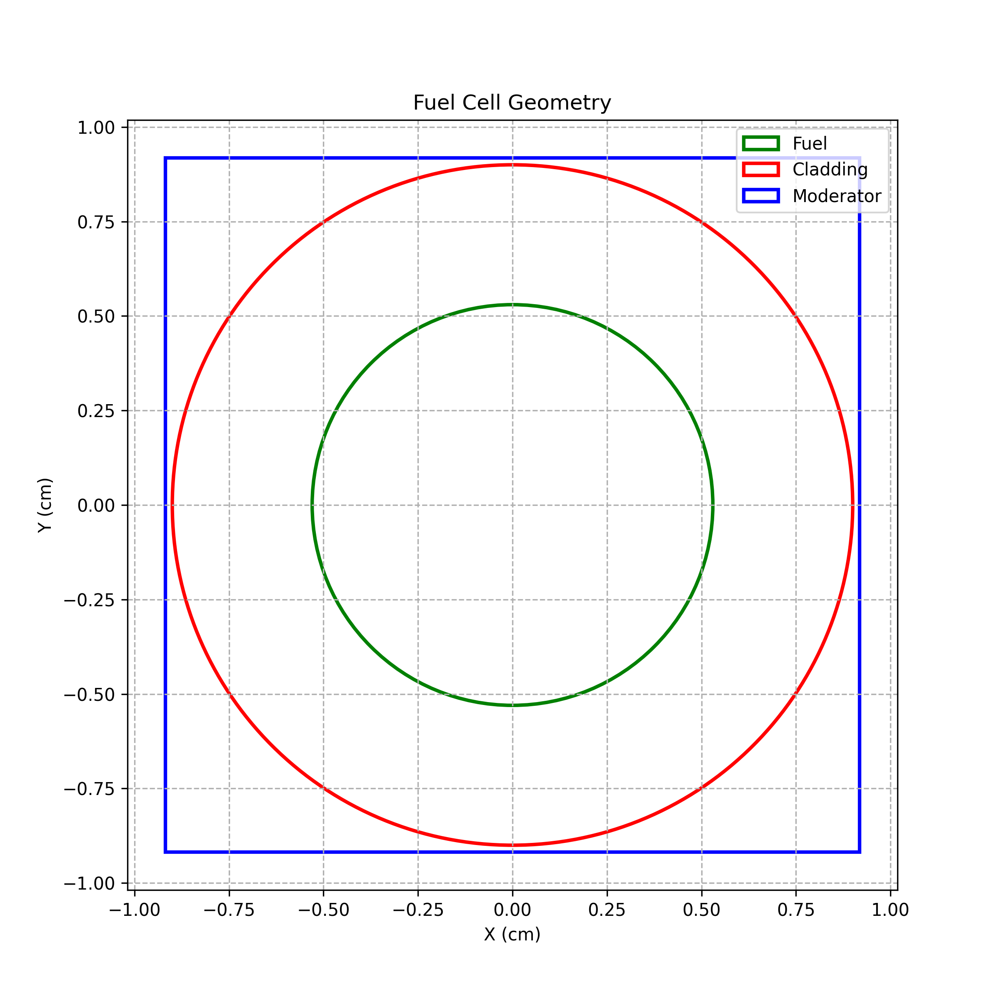

# 2D-Monte-Carlo-Neutron-Transport-QualifyingMC
# 2D Monte Carlo Neutron Transport Simulation

This repository contains a Python-based Monte Carlo simulation of neutron transport within a 2D cylindrical fuel cell. The model tracks neutron interactions such as scattering, capture, fission, and leakage, and compares the resulting neutron flux spectrum with a standard Watt spectrum.

The simulation is inspired by academic research on Monte Carlo modeling of neutron interactions, such as the thesis:

"Modeling Neutron Interaction Inside a 2D Reactor Using Monte Carlo Method"  
A.S.M. Fakhrul Islam, University of South Carolina, 2019

## Features
- Maxwellian-distributed neutron source
- Geometry: fuel, cladding, and moderator
- Interaction types: scattering, capture, fission
- Energy-dependent cross sections
- Visualization of neutron trajectories and flux spectrum
## Images




## Requirements

This project requires the following Python packages:

- numpy
- matplotlib
- scipy
- pylab (Note: usually comes with matplotlib)

### Installation

You can install the required packages using pip:

```bash
pip install numpy matplotlib scipy
## Getting Started
Install the required Python libraries:
## References

- Islam, A. S. M. Fakhrul. *Modeling Neutron Interaction Inside a 2D Reactor Using Monte Carlo Method*. Master’s thesis, University of South Carolina, 2019.  
  Available at: https://scholarcommons.sc.edu/cgi/viewcontent.cgi?article=6511&context=etd

